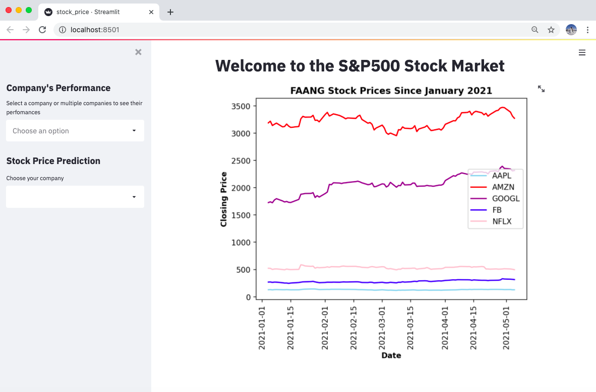
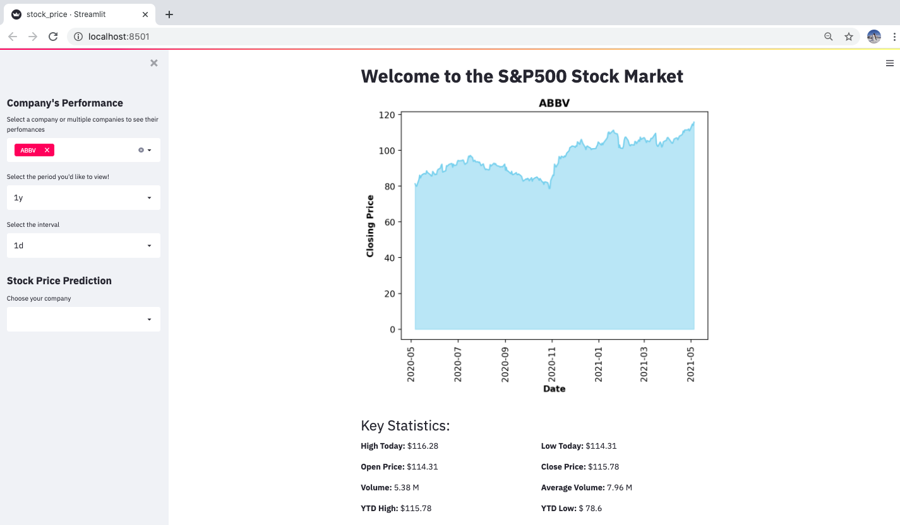
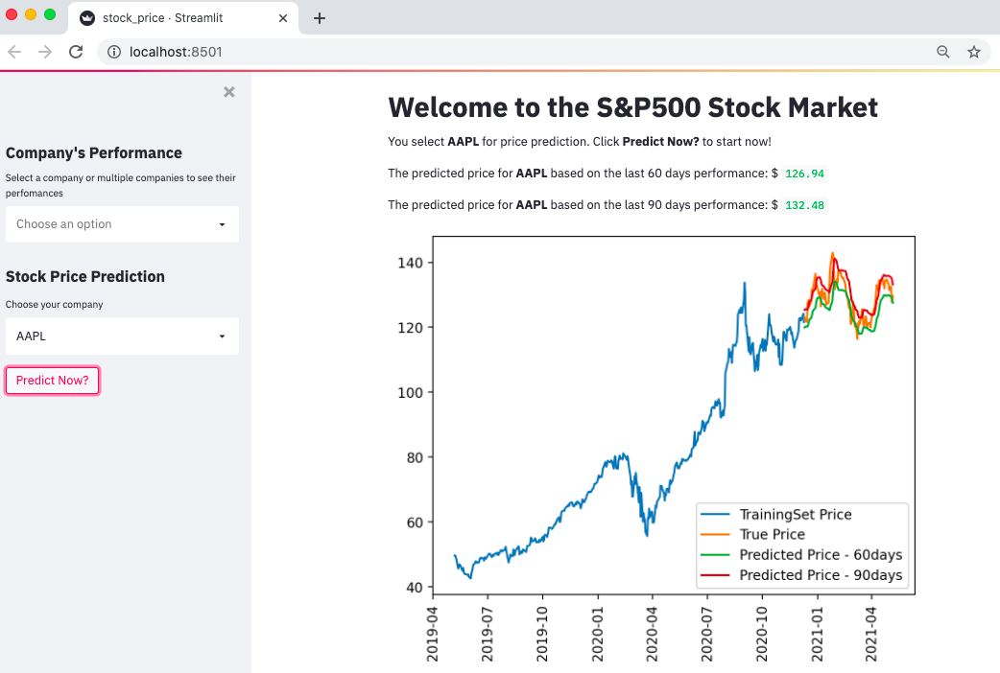

# stock_price_prediction
A mini desktop app for stock performance prediction using machine learning. 
It uses Yahoo Finance API to obtain stock price data and LTSM Neural Network for stock price prediction.


## Common Setup 
Clone the repo and install the dependencies. 

```bash
git clone https://github.com/sophannaek/stock_price_prediction.git
cd stock_price_prediction
```

Use the package manager [pip](https://packaging.python.org/tutorials/installing-packages/) to install the dependency 
## Streamlit
To get install Streamlit, visit [here](https://docs.streamlit.io/en/stable/)
```
pip install streamlit 

or 

pip3 install streamlit
```

## Snapshots of the Application

Homepage 


A Closer Look to Each Company's Performance


Stock Price Comparison between Two Companies


Apple Inc Stock Price Prediction
